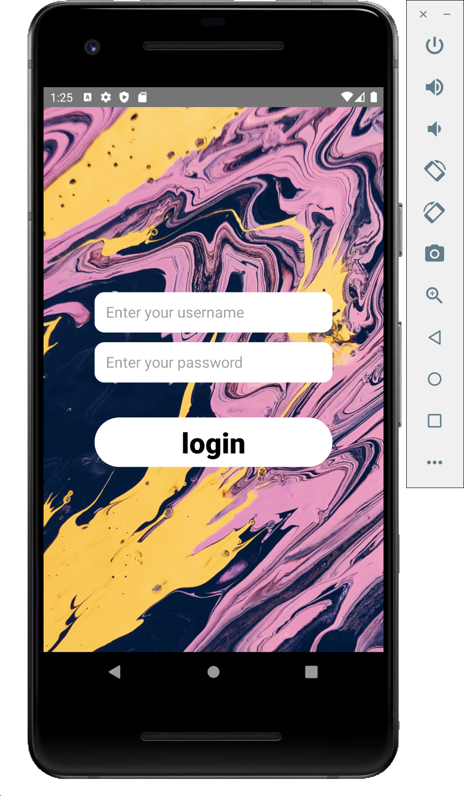
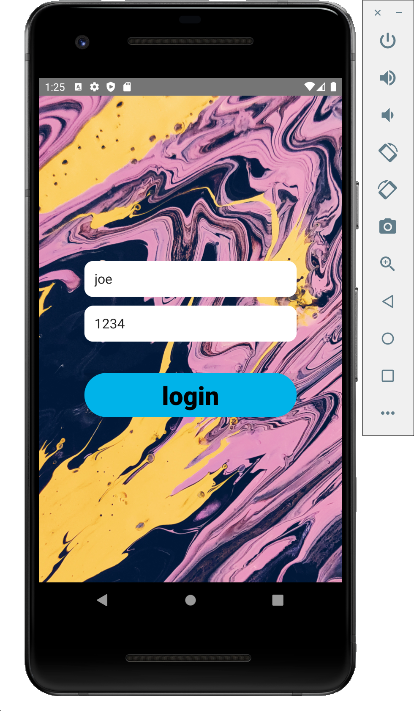
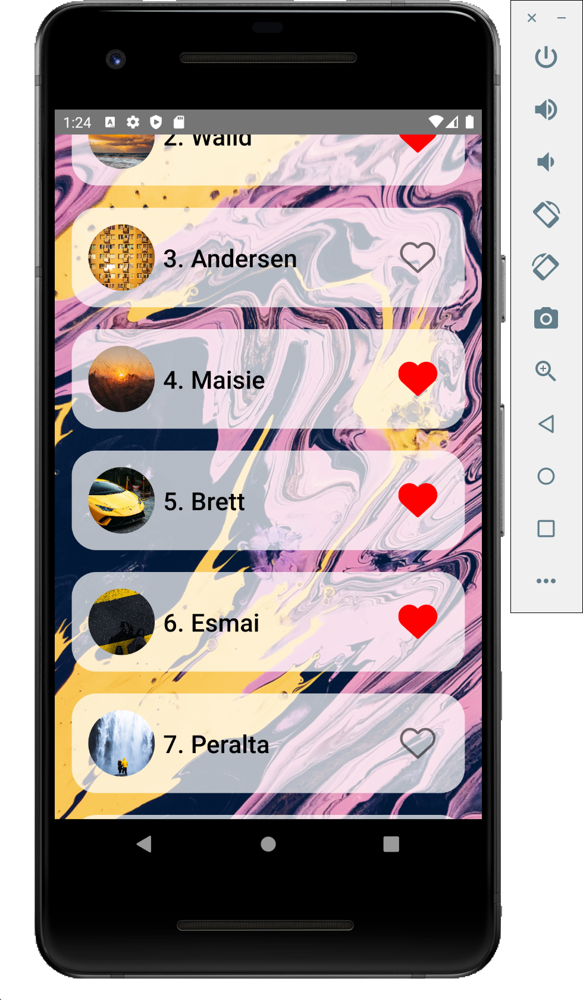
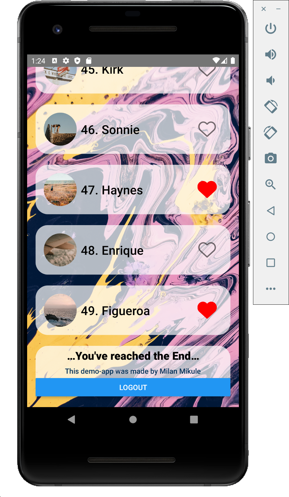

# Code Challenge Demo app

[You can find the Demo-video of the Code-Challenge here
](./src/Assets/DemonstrationAssets/codechallenge.mp4 "Demonstration video of the simple app flow")

## The Screens are:

